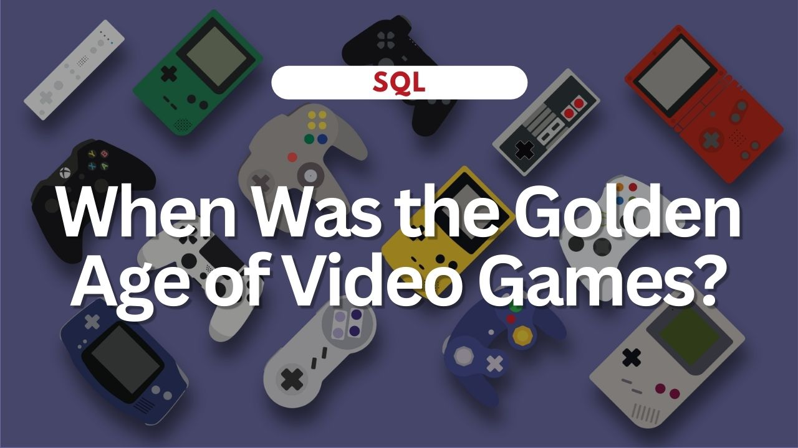

# When Was the Golden Age of Video Games?

A DataCamp SQL project in which I search for the golden age of video games by identifying release years that users and critics liked best, as well as exploring the business side of gaming by looking at game sales data.

**[Click here](https://github.com/jessicabohannon/When-Was-the-Golden-Age-of-Video-Games/blob/main/notebook.ipynb)** to view the project.

Skills used:
* Data manipulation
* Joining data in SQL
* Comparing results with set theory
* Subqueries
* Aggregate functions
* Filtering grouped data
* Sorting, filtering, and grouping query results
